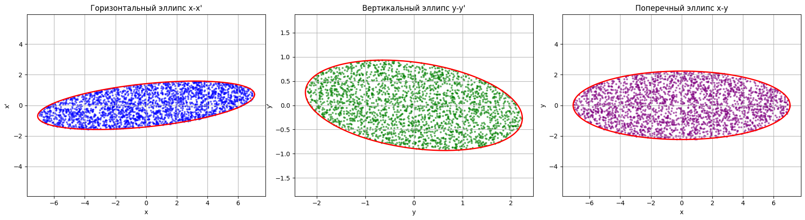
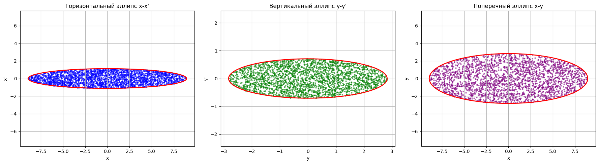
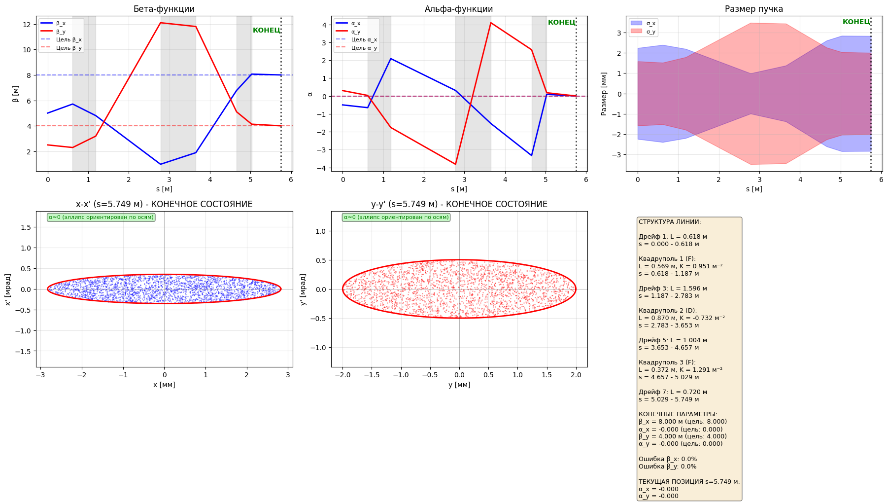

## Моделирование пучка, проходящего через тонкие линзы
### ДРЕЙФ - КВАДРУПОЛЬ - ДРЕЙФ - КВАДРУПОЛЬ - ДРЕЙФ - КВАДРУПОЛЬ - ДРЕЙФ

рис. 1 (Данные пучка до триплета из тонких линз)

рис. 2 (Данные пучка после прохождения триплета)

### параметры
Начальные параметры:
  X: β₀ = 5.0000 м, α₀ = -0.5000
  Y: β₀ = 2.5000 м, α₀ = +0.3000

Конфигурация:
  Дрейфы: 1.395 → 1.512 → 0.958 → 0.596 м
  Квадруполи: f1=+3.2641, f2=-1.6571, f3=+2.9923 м

Конечные параметры:
  X: β = 8.001954 м, α = +0.000715
  Y: β = 3.999679 м, α = +0.001274

## Моделирование пучка, проходящего через толстые линзы
### ДРЕЙФ - КВАДРУПОЛЬ - ДРЕЙФ - КВАДРУПОЛЬ - ДРЕЙФ - КВАДРУПОЛЬ - ДРЕЙФ

рис. 3 (данные пучка)

================================================================

\documentclass[12pt,a4paper]{article}

\usepackage[T2A]{fontenc}
\usepackage[utf8]{inputenc}
\usepackage[russian]{babel}
\usepackage{amsmath, amssymb, amsfonts, amsthm}
\usepackage{physics}
\usepackage{geometry}
\usepackage{graphicx}
\usepackage{booktabs}
\usepackage{array}
\usepackage{setspace}
\usepackage{hyperref}
\usepackage{indentfirst}
\usepackage{titlesec}
\usepackage{enumitem}

\geometry{left=25mm,right=25mm,top=25mm,bottom=25mm}
\onehalfspacing
\setlength{\parindent}{1.25cm}
\setlength{\parskip}{0pt}

\hypersetup{
    colorlinks=true,
    linkcolor=black,
    urlcolor=blue,
    citecolor=black
}

\titleformat{\section}{\large\bfseries}{\thesection.}{0.5em}{}
\titleformat{\subsection}{\normalsize\bfseries}{\thesubsection.}{0.5em}{}

\begin{document}

\begin{titlepage}
    \begin{center}
        \vfill

        {\large \textbf{СОГЛАСОВАНИЕ ПАРАМЕТРОВ ПУЧКА\\
        ПЕРЕД ВХОДОМ В СИНХРОТРОН}}\\[1.5cm]

        {\normalsize
        Рогожкина А.\,Д., ВМК МГУ\\
        Лазарев Г.\,А., ВМК МГУ\\
        Борисов А.\,А., ИЯФИТ НИЯУ МИФИ\\
        Копылов А.\,А., ФИИТ МАИ
        }

        \vfill

        07 марта 2026 года\\
        Москва
    \end{center}
\end{titlepage}

\section{Постановка задачи}

Рассматривается пучок заряженных частиц, для которого на входе в согласующую секцию известны начальные параметры Твисса
\[
(\alpha_x^{\mathrm{in}},\beta_x^{\mathrm{in}}), \qquad
(\alpha_y^{\mathrm{in}},\beta_y^{\mathrm{in}})
\]
и эмиттансы
\[
\varepsilon_x,\qquad \varepsilon_y.
\]

Требуется построить такую магнитную систему, которая переводит пучок в состояние с заданными выходными параметрами
\[
(\alpha_x^{\mathrm{out}},\beta_x^{\mathrm{out}}), \qquad
(\alpha_y^{\mathrm{out}},\beta_y^{\mathrm{out}})
\]
при выполнении условий
\[
\varepsilon_x^{\mathrm{out}}=\varepsilon_x^{\mathrm{in}},\qquad
\varepsilon_y^{\mathrm{out}}=\varepsilon_y^{\mathrm{in}}.
\]

Иными словами, необходимо скорректировать только параметры фазового эллипса, не изменяя его площадь. Физически это соответствует задаче \textit{matching} --- согласованию пучка с входными условиями ускорителя.

В данной работе рассматривается согласующая секция вида
\[
\text{Д}_1-\text{К}_1-\text{Д}_2-\text{К}_2-\text{Д}_3-\text{К}_3-\text{Д}_4,
\]
где длины дрейфов $\text{Д}_i$ могут различаться, а квадруполи $\text{К}_i$ характеризуются своими фокусирующими параметрами.

Содержательно задача решается следующим образом. Сначала дрейфовый участок изменяет параметры Твисса в обеих плоскостях по известным формулам свободного пролёта. Затем квадруполь, фокусируя в одной плоскости и дефокусируя в другой, позволяет сжать или перераспределить фазовый эллипс. За счёт последовательного чередования дрейфов и трёх квадруполей становится возможным добиться такого состояния, при котором к выходу секции одновременно выполняются целевые условия по горизонтальной и вертикальной плоскостям.

\section{Теоретическая основа}

\subsection{Параметры Твисса и фазовый эллипс}

В одной поперечной плоскости фазовое состояние пучка описывается эллипсом в координатах $(x,x')$:
\[
\gamma x^2 + 2\alpha x x' + \beta x'^2 = \varepsilon,
\]
где
\[
\gamma=\frac{1+\alpha^2}{\beta}.
\]

Параметр $\beta$ связан с характерным размером пучка, параметр $\alpha$ определяет наклон фазового эллипса, а $\gamma$ выражается через $\alpha$ и $\beta$ как зависимая величина. Эмиттанс $\varepsilon$ задаёт фазовую площадь, занимаемую пучком.

Более удобно представлять пучок через матрицу вторых моментов:
\[
\Sigma = \varepsilon
\begin{pmatrix}
\beta & -\alpha\\
-\alpha & \gamma
\end{pmatrix}.
\]
Тогда RMS-эмиттанс определяется как
\[
\varepsilon = \sqrt{\det \Sigma}.
\]

\subsection{Матричный перенос}

Если перенос частицы через линейный элемент описывается матрицей
\[
M=
\begin{pmatrix}
m_{11} & m_{12}\\
m_{21} & m_{22}
\end{pmatrix},
\]
то матрица пучка преобразуется по закону
\[
\Sigma_{\mathrm{out}} = M \Sigma_{\mathrm{in}} M^T.
\]

Из этого соотношения выводятся формулы переноса параметров Твисса:
\begin{align}
\beta_{\mathrm{out}} &= m_{11}^2 \beta_{\mathrm{in}}
-2m_{11}m_{12}\alpha_{\mathrm{in}}
+m_{12}^2\gamma_{\mathrm{in}},\\[0.3cm]
\alpha_{\mathrm{out}} &= -m_{11}m_{21}\beta_{\mathrm{in}}
+(m_{11}m_{22}+m_{12}m_{21})\alpha_{\mathrm{in}}
-m_{12}m_{22}\gamma_{\mathrm{in}},\\[0.3cm]
\gamma_{\mathrm{out}} &= m_{21}^2 \beta_{\mathrm{in}}
-2m_{21}m_{22}\alpha_{\mathrm{in}}
+m_{22}^2\gamma_{\mathrm{in}}.
\end{align}

Если матрица переноса симплектична, то
\[
\det M = 1,
\]
а значит, в линейной идеализации эмиттанс сохраняется.

\section{Модель элементов согласующей секции}

\subsection{Дрейф}

Для дрейфа длины $L$ матрица переноса имеет вид
\[
M_D(L)=
\begin{pmatrix}
1 & L\\
0 & 1
\end{pmatrix}.
\]

Данный элемент не оказывает фокусирующего действия, однако существенно влияет на параметры Твисса за счёт свободной эволюции фазового эллипса. Для дрейфа выполняются соотношения:
\begin{align}
\beta(L) &= \beta_0 - 2\alpha_0 L + \gamma_0 L^2,\\
\alpha(L) &= \alpha_0 - \gamma_0 L,\\
\gamma(L) &= \gamma_0.
\end{align}

Именно эта эволюция используется в работе как активный инструмент подбора. Изменяя длину дрейфа, можно заранее ``подвести'' параметры Твисса к такому состоянию, в котором следующий квадруполь даст требуемый эффект сжатия или компенсации.

\subsection{Квадруполь в приближении тонкой линзы}

В приближении тонкой линзы квадруполь рассматривается как элемент нулевой длины с конечной фокусирующей силой. Его матрица в фокусирующей плоскости имеет вид
\[
M_{Q,\mathrm{thin}}^{(f)}=
\begin{pmatrix}
1 & 0\\
-\frac{1}{f} & 1
\end{pmatrix},
\]
а в дефокусирующей плоскости
\[
M_{Q,\mathrm{thin}}^{(d)}=
\begin{pmatrix}
1 & 0\\
+\frac{1}{f} & 1
\end{pmatrix}.
\]

Такое описание удобно для предварительного подбора параметров, аналитических оценок и первичной оптимизации секции.

\subsection{Квадруполь в приближении толстой линзы}

Более реалистичная модель учитывает конечную длину квадруполя $l$ и градиент поля, задающий фокусирующий коэффициент $k$. Тогда в одной плоскости матрица имеет тригонометрический вид:
\[
M_{Q,\mathrm{thick}}^{(f)}=
\begin{pmatrix}
\cos(\sqrt{k}\,l) & \dfrac{1}{\sqrt{k}}\sin(\sqrt{k}\,l)\\[0.3cm]
-\sqrt{k}\sin(\sqrt{k}\,l) & \cos(\sqrt{k}\,l)
\end{pmatrix},
\qquad k>0,
\]
а в другой плоскости --- гиперболический:
\[
M_{Q,\mathrm{thick}}^{(d)}=
\begin{pmatrix}
\cosh(\sqrt{k}\,l) & \dfrac{1}{\sqrt{k}}\sinh(\sqrt{k}\,l)\\[0.3cm]
\sqrt{k}\sinh(\sqrt{k}\,l) & \cosh(\sqrt{k}\,l)
\end{pmatrix}.
\]

Именно различие между тонколинзовым и толстолинзовым описаниями стало одной из центральных трудностей проекта. При использовании тонкой линзы квадруполь изменяет главным образом угол фазовой траектории на локальном участке, тогда как в модели толстой линзы внутри самого элемента уже происходит заметная эволюция координаты и угла. Поэтому набор параметров, найденный в тонколинзовом приближении, вообще говоря, не обязан точно воспроизводить целевые значения в полном толстолинзовом расчёте.

\section{Полная матрица секции Д--К--Д--К--Д--К--Д}

Для каждой поперечной плоскости полная матрица переноса секции записывается как произведение матриц отдельных элементов:
\[
M_{\mathrm{sec}}=
M_{D_4}\,M_{Q_3}\,M_{D_3}\,M_{Q_2}\,M_{D_2}\,M_{Q_1}\,M_{D_1}.
\]

Здесь необходимо подчеркнуть, что матрицы квадруполей различны для горизонтальной и вертикальной плоскостей, поскольку фокусировка в одной плоскости сопровождается дефокусировкой в другой. Следовательно,
\[
M_{\mathrm{sec}}^{(x)} \neq M_{\mathrm{sec}}^{(y)},
\]
хотя геометрическая последовательность элементов остаётся общей.

Условие согласования формулируется как выполнение одновременно двух систем:
\begin{align}
\Sigma_x^{\mathrm{out}} &= M_{\mathrm{sec}}^{(x)} \Sigma_x^{\mathrm{in}} \left(M_{\mathrm{sec}}^{(x)}\right)^T
= \Sigma_x^{\mathrm{target}},\\
\Sigma_y^{\mathrm{out}} &= M_{\mathrm{sec}}^{(y)} \Sigma_y^{\mathrm{in}} \left(M_{\mathrm{sec}}^{(y)}\right)^T
= \Sigma_y^{\mathrm{target}}.
\end{align}

Тем самым одна и та же конфигурация должна одновременно обеспечить нужный результат в обеих поперечных плоскостях. Важно, что желаемое преобразование достигается не независимой настройкой каждого квадруполя, а совместным действием всей цепочки. Дрейф изменяет текущие значения $\alpha$ и $\beta$, после чего квадруполь использует это состояние для более эффективного воздействия на фазовый эллипс.

\section{Проблема тонкой и толстой линзы}

\subsection{Причина расхождения моделей}

На первом этапе проектирования естественно применять приближение тонкой линзы, так как оно позволяет проще анализировать роль каждого квадруполя и быстро находить рабочие конфигурации. Однако при переходе к более точной модели выясняется, что конечная длина квадруполя вносит дополнительную фазовую эволюцию, которая влияет на итоговые параметры Твисса.

Причина этого состоит в следующем:
\begin{enumerate}[label=\arabic*)]
    \item в тонколинзовой модели весь фокусирующий эффект сосредоточен в одной точке;
    \item в толстолинзовой модели пучок изменяется непрерывно на протяжении всего магнита;
    \item дрейфовая часть, ``спрятанная'' внутри реального квадруполя, уже не может быть проигнорирована;
    \item при нескольких квадруполях накопленная разница между моделями становится существенной.
\end{enumerate}

\subsection{Физический смысл проблемы}

С практической точки зрения это означает, что найденная в тонколинзовом расчёте схема не является окончательным ответом, а служит лишь хорошим стартовым приближением. Для реального описания секции необходимо:
\begin{enumerate}[label=\arabic*)]
    \item либо сразу использовать толстолинзовую модель;
    \item либо сначала подобрать параметры в тонколинзовом приближении, а затем выполнить уточняющую подстройку в толстолинзовом расчёте.
\end{enumerate}

Именно такой подход представляется наиболее разумным в инженерно-физической постановке задачи: тонкая линза обеспечивает простоту поиска, а толстая линза --- физическую достоверность.

\section{Алгоритм подбора параметров}

В работе использовался численный алгоритм активного поиска конфигурации триплета. Его идея состоит в разделении задачи на два уровня: геометрию секции задают длины дрейфов, а фокусирующее воздействие --- силы трёх квадруполей.

\subsection{Этап 1. Задание входных и целевых параметров}

На первом этапе задаются:
\begin{itemize}
    \item начальные параметры Твисса в плоскостях $x$ и $y$;
    \item целевые параметры Твисса на входе в синхротрон;
    \item допустимые диапазоны длин дрейфовых промежутков;
    \item модель квадруполя: тонкая или толстая линза.
\end{itemize}

\subsection{Этап 2. Выбор пробной геометрии секции}

Далее выбирается набор длин дрейфов
\[
(L_1,L_2,L_3,L_4).
\]
Этот шаг может выполняться различными численными методами: перебором по сетке, случайным поиском, генетическим алгоритмом или их комбинацией. Смысл этапа состоит в поиске такой геометрии, при которой дрейфовые участки искажают текущие значения $\alpha$ и $\beta$ в благоприятную для последующей квадрупольной коррекции область.

\subsection{Этап 3. Вычисление параметров квадруполей}

Для каждой пробной конфигурации дрейфов рассчитываются такие параметры трёх квадрупольных линз, при которых суммарная матрица переноса секции максимально близко переводит входные параметры Твисса в целевые. Тем самым квадруполи не выбираются независимо от дрейфов, а вычисляются как отклик на найденную геометрию секции.

\subsection{Этап 4. Проверка достижения целевых параметров}

После построения полной матрицы переноса вычисляются выходные значения
\[
\alpha_x^{\mathrm{out}},\ \beta_x^{\mathrm{out}},\ 
\alpha_y^{\mathrm{out}},\ \beta_y^{\mathrm{out}}.
\]
Далее оценивается ошибка согласования как отклонение выходных параметров от целевых. Конфигурация считается успешной, если ошибка по обеим плоскостям не превышает заданного допуска.

\subsection{Этап 5. Сравнение найденных конфигураций}

Среди всех протестированных конфигураций выбираются те, которые:
\begin{itemize}
    \item обеспечивают наименьшую ошибку по параметрам Твисса;
    \item сохраняют эмиттанс в пределах численной точности;
    \item обладают физически реализуемыми длинами дрейфов и силами квадруполей.
\end{itemize}

\subsection{Этап 6. Уточнение в толстолинзовой модели}

Если предварительный подбор выполнялся в тонколинзовом приближении, лучшая найденная конфигурация затем повторно проверяется в модели толстых линз. При необходимости производится дополнительная корректировка длин дрейфов и фокусирующих параметров до получения устойчивого совпадения с целевыми значениями.

\section{Результаты}

Проведённый подбор показал, что конфигурация Д--К--Д--К--Д--К--Д обладает достаточной гибкостью для решения задачи согласования параметров пучка перед входом в ускоритель. Наличие трёх квадруполей позволяет одновременно влиять на параметры в двух поперечных плоскостях и компенсировать взаимосвязанный характер фокусировки и дефокусировки.

Принципиально важным результатом является то, что рабочее решение достигается не прямой попыткой ``сразу'' установить нужные параметры $\alpha$ и $\beta$ одним магнитом, а поэтапным преобразованием фазового эллипса. Сначала дрейф искажает параметры в заданном направлении, затем квадрупольная линза производит требуемое сжатие или перераспределение в одной плоскости, одновременно создавая контролируемое изменение в другой. Следующий дрейф переносит пучок уже в новое состояние, после чего последующий квадруполь вновь корректирует эллипс. Тем самым согласование достигается последовательностью управляемых деформаций, а не одиночным актом фокусировки.

Одновременно было установлено, что различие между тонкой и толстой линзой не является второстепенным техническим нюансом. Напротив, оно принципиально важно при переходе от концептуальной схемы к физически правдоподобной модели. Если ограничиться только тонколинзовым описанием, то можно получить параметры, которые выглядят корректными математически, но не воспроизводятся при более точном моделировании реальных магнитов. Следовательно, окончательное согласование должно проводиться именно в толстолинзовой постановке, а тонколинзовый расчёт следует рассматривать как вспомогательный этап.

\section{Заключение}

В работе рассмотрена задача согласования параметров поперечного движения заряженного пучка перед входом в синхротрон. Показано, что данная задача естественно формулируется в терминах параметров Твисса и матриц вторых моментов, а её решение может быть построено на основе линейной матричной оптики.

Предложена и исследована согласующая секция вида Д--К--Д--К--Д--К--Д. Установлено, что такая конфигурация позволяет преобразовывать входные параметры $\alpha$ и $\beta$ в требуемые выходные значения при сохранении эмиттанса. Существенным содержательным итогом работы является установление механизма такого преобразования: дрейфовые промежутки намеренно выводят параметры Твисса в промежуточные состояния, а квадрупольные линзы используют эти состояния для последовательного сжатия и компенсации фазового эллипса в нужных плоскостях.

Особое внимание уделено сравнению моделей тонкой и толстой квадрупольной линзы. Показано, что тонколинзовое приближение удобно на этапе первичного подбора, однако окончательная верификация и уточнение параметров должны проводиться в толстолинзовой модели, более адекватно отражающей физику реальных магнитных элементов.

Полученные результаты могут служить основой для дальнейшего развития модели, включая:
\begin{itemize}
    \item учёт дисперсии при наличии изгибающих магнитов;
    \item анализ устойчивости секции к ошибкам настройки;
    \item моделирование апертурных ограничений;
    \item переход к нелинейной динамике и исследованию возможного роста RMS-эмиттанса в неидеальных системах.
\end{itemize}

Таким образом, разработанная схема и предложенный алгоритм поиска показывают, что даже сравнительно компактная система из трёх квадруполей и четырёх дрейфов может быть использована как эффективный инструмент согласования пучка перед вводом в ускорительный комплекс.

\begin{thebibliography}{9}

\bibitem{twiss}
Courant E. D., Snyder H. S.
\textit{Theory of the Alternating-Gradient Synchrotron}.
Annals of Physics, 1958.

\bibitem{wiedemann}
Wiedemann H.
\textit{Particle Accelerator Physics}.
Springer, 4th ed., 2015.

\bibitem{lee}
Lee S. Y.
\textit{Accelerator Physics}.
World Scientific, 3rd ed., 2012.

\bibitem{reiser}
Reiser M.
\textit{Theory and Design of Charged Particle Beams}.
Wiley-VCH, 2nd ed., 2008.

\bibitem{uspas}
USPAS lecture notes on transverse beam optics and matching sections.

\bibitem{cern}
CERN lecture materials on transverse beam dynamics, emittance and matching.

\bibitem{internal}
Согласование параметров пучка с входом в ускоритель: систематизация теории и пошаговый алгоритм моделирования. Рабочие материалы проекта, 2026.

\end{thebibliography}

\end{document}
